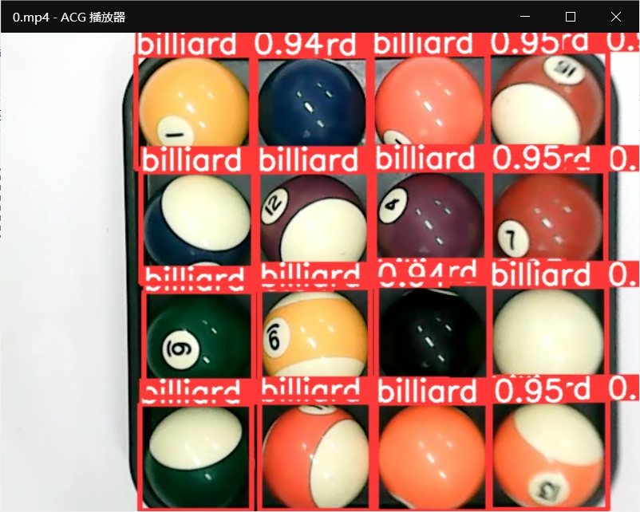
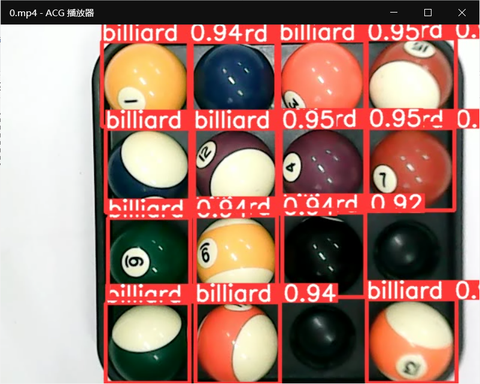
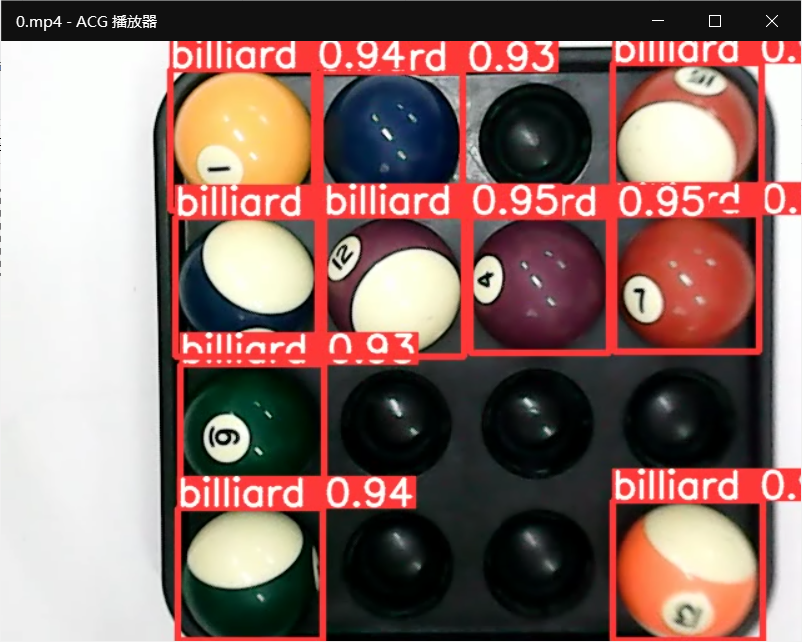
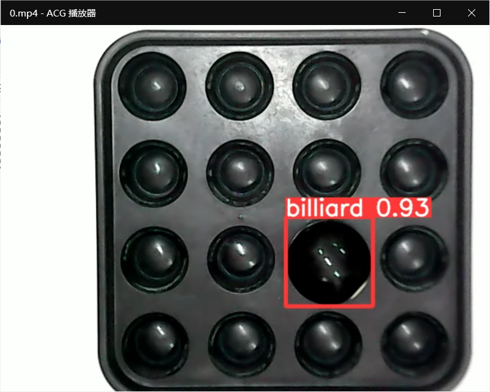
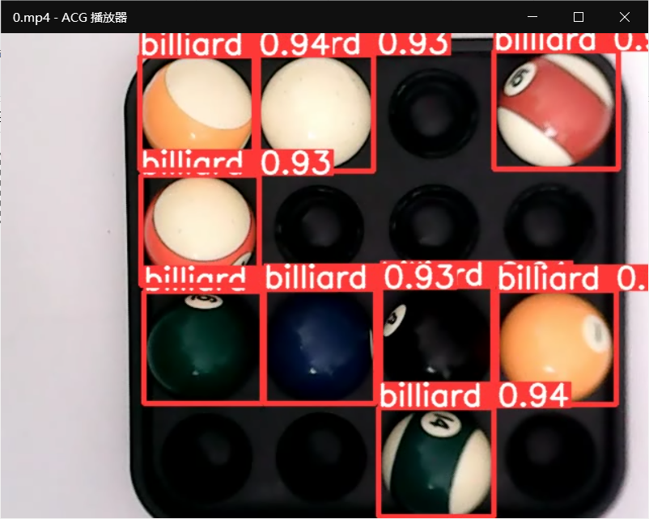
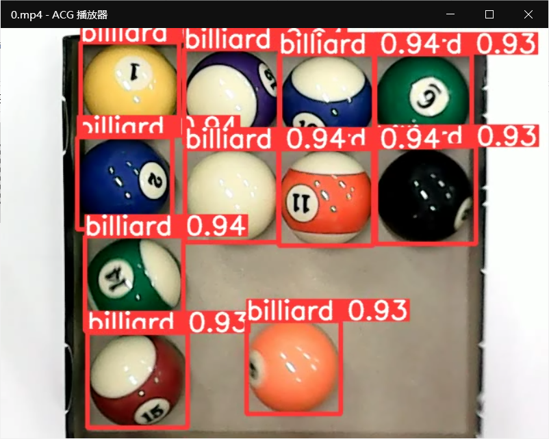
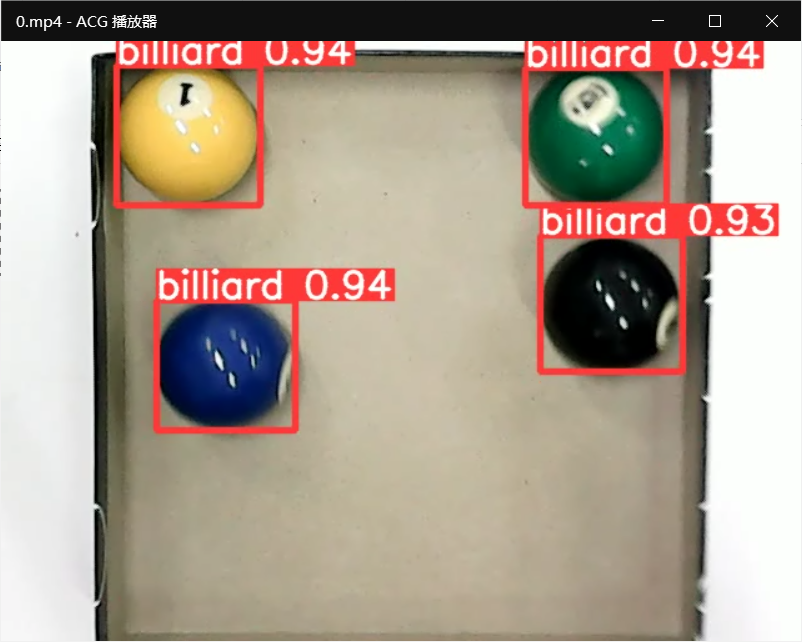

# YOLOv5-BilliardsDetection
使用YOLOv5识别美式台球（已标注的训练数据和模型）
## 说明
* 只提供了YOLOv5数据集（包括标注）/BilliardsDatasets和训练的模型billiards.pt
* 训练数据集较小，300多张，且场景较为单一，主要为了满足毕设特定场景下的需求，该模型在复杂场景下的表现没有测试过，但应该不会太好
* 我尝试过两种思路：一、只用一类台球数据来训练；二、用coco的80类数据再加上1类台球共81个类别的数据训练（每类数据量大体相同）。后来发现前者在我的应用场景下表现更好（我准备用该模型来对台球进行计数）
* 没有对具体台球种类进行细分，不论是黑球、白球还是小花大花都会被识别为“台球”

## 效果
|效果|说明|
|---|---|
||台球全满|
||少2颗台球|
||少6颗台球|
||黑球在刁钻角度时的识别效果（对于黑色的球拖来说黑球不容易识别，然而训练出来识别效果很不错）|
||光线较暗时的效果|
||换个球盒|
||换个球盒|
